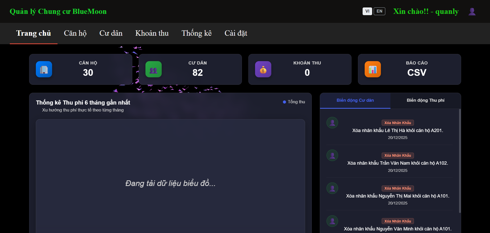

# 🏙️ Hệ thống Quản lý Chung cư (Frontend)

Đây là dự án **Frontend** cho phần mềm **Quản lý Chung cư**, được xây dựng bằng **ReactJS**.  
Ứng dụng cung cấp một giao diện bảng điều khiển (Dashboard) hiện đại, trực quan, hỗ trợ Ban quản lý thực hiện các nghiệp vụ hành chính và tài chính một cách hiệu quả.

Giao diện được thiết kế theo phong cách **Glassmorphism (Kính mờ)** sang trọng, hỗ trợ chế độ nền tối (Dark Mode) và đa ngôn ngữ (Tiếng Việt / Tiếng Anh).



---

## 🚀 Các Tính năng Nổi bật

Hệ thống được chia thành các phân hệ chính hỗ trợ đầy đủ quy trình quản lý:

### 1. 📊 Trang chủ (Dashboard)
* **Tổng quan:** Hiển thị nhanh các chỉ số quan trọng (Số lượng căn hộ, Cư dân, Tổng khoản thu).
* **Biểu đồ thống kê:** Theo dõi xu hướng doanh thu phí dịch vụ qua các tháng.
* **Nhật ký hoạt động:** Cập nhật thời gian thực các biến động về nhân khẩu (đăng ký tạm trú/tạm vắng) và trạng thái thu phí mới nhất.

### 2. 🏢 Quản lý Căn hộ
* **Danh sách Căn hộ:** Quản lý thông tin chi tiết của từng căn hộ trong tòa nhà.
* **Chế độ hiển thị:** Linh hoạt chuyển đổi giữa dạng **Lưới (Grid)** chia theo tòa nhà và dạng **Danh sách (List)** truyền thống.
* **Bộ lọc thông minh:** Tìm kiếm căn hộ theo diện tích, số phòng ngủ, trạng thái sử dụng.

### 3. 👥 Quản lý Cư dân
* **Hồ sơ Cư dân:** Lưu trữ và tra cứu thông tin chi tiết (CCCD, SĐT, Quê quán...).
* **Quản lý Hộ gia đình:** Theo dõi thành viên trong hộ, hỗ trợ chức năng tách hộ hoặc đổi chủ hộ.
* **Thủ tục hành chính:**
    * Đăng ký **Tạm trú / Tạm vắng** trực tuyến.
    * Thêm mới hoặc xóa nhân khẩu.
* **Tra cứu lịch sử:** Xem lại lịch sử thay đổi thông tin nhân khẩu của từng cá nhân.
* **Thống kê nhân khẩu:** Phân tích dữ liệu cư dân theo độ tuổi, giới tính và thời gian.

### 4. 💰 Quản lý Tài chính & Khoản thu
* **Khoản thu Bắt buộc:**
    * Tạo các đợt thu phí định kỳ (Phí dịch vụ, gửi xe, vệ sinh...).
    * Theo dõi trạng thái đóng phí của từng căn hộ.
    * Hệ thống **Nhắc nợ** tự động hiển thị các căn hộ còn nợ phí.
* **Đóng góp Tự nguyện:** Quản lý các đợt vận động quyên góp (Quỹ từ thiện, ủng hộ...).
* **Lịch sử thanh toán:** Tra cứu chi tiết lịch sử giao dịch của từng căn hộ.

### 5. ⚙️ Cài đặt hệ thống
* Tùy chỉnh thông tin chung của tòa nhà.
* Quản lý thông tin tài khoản quản trị, quy định và hạn mức.
---

## 💻 Công nghệ sử dụng

* **Frontend:** React (v18), React Router v6.
* **Styling:** SCSS (Sass) với kiến trúc Module.
* **HTTP Client:** Axios.
* **Visualization:** Chart.js, React-Chartjs-2.
* **Effects:** Vanta.js (Hiệu ứng nền động).
* **Internationalization:** react-i18next.

### Backend (Yêu cầu)
* Dự án này yêu cầu một backend **Spring Boot (Java)** đang chạy tại địa chỉ `http://localhost:8080`.  
* Backend sử dụng **JWT (JSON Web Token)** để xác thực.

---

## 🚀 Bắt đầu

Hướng dẫn cài đặt và chạy dự án này trên máy local của bạn.

### 1. Clone Repository
```bash
git clone https://github.com/Dinhthuy2k5/QL-Chung-cu.git
cd QL-Chung-cu
```

### 2. Cài đặt Dependencies
Dự án này có thể có xung đột phiên bản TypeScript giữa react-scripts và các thư viện mới hơn.
Sử dụng cờ --legacy-peer-deps để bỏ qua kiểm tra và cài đặt:
```bash
npm install --legacy-peer-deps
```

### 3. Khởi chạy Dự án
Sau khi cài đặt thành công, khởi chạy server phát triển:
```bash
npm start
```
Ứng dụng sẽ tự động mở trong trình duyệt của bạn tại http://localhost:3000.

### 4. Yêu cầu Bắt buộc
Đảm bảo rằng máy chủ Backend Spring Boot của bạn đang chạy tại địa chỉ http://localhost:8080 để các API có thể hoạt động.

### 📁 Cấu trúc Thư mục
```bash
src/
├── components/          # Các component con tái sử dụng
│   ├── apartment_component/
│   ├── home_component/
│   ├── receipt_component/
│   └── resident_component/
├── HOC/                 # Các Higher-Order Components (v.d: withRouter)
├── locales/             # Các file dịch thuật (en/vi)
│   ├── en/
│   └── vi/
├── pages/               # Các trang độc lập (v.d: Login, Change_Infor)
├── services/            # Các dịch vụ (v.d: localStorageService)
├── styles/              # Các file SCSS chính và chung
│   ├── home-styles/
│   ├── receipt-styles/
│   └── ...
├── views/               # Các component trang chính (tương ứng với 1 tab)
│   ├── Home.js
│   ├── Apartments.js
│   ├── Residents.js
│   ├── Receipt.js
│   ├── Settings.js
│   └── Nav/
├── App.js               # Component gốc, quản lý state chính và routes
├── i18n.js              # Cấu hình đa ngôn ngữ
└── index.js             # Điểm bắt đầu của ứng dụng
```

### 🧑‍💻 Tác giả & Đóng góp
Dự án được phát triển bởi Nguyễn Đình Thủy.
Nếu bạn muốn đóng góp, hãy fork repository này và gửi pull request.